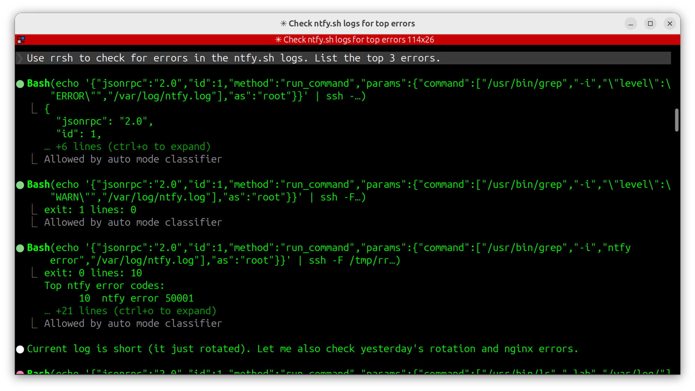
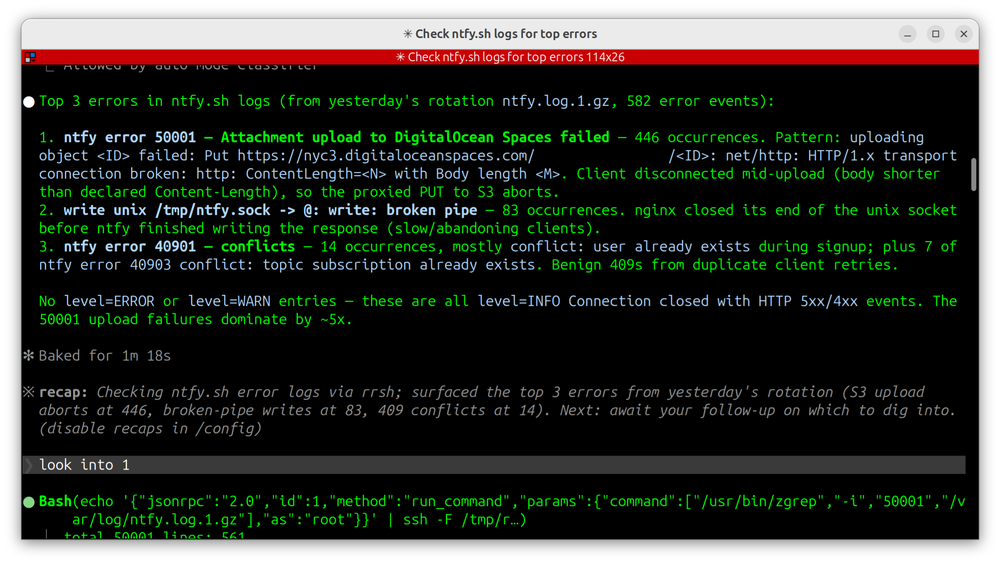

# rrsh - really restricted shell

A JSON-RPC based shell that lets an AI agent (Claude, Cursor) run a curated set of commands on a remote host. Installs as a user's login shell so sshd handles auth and transport - **no daemon to keep running, no port to firewall, no auth code in rrsh itself**. The project has zero runtime dependencies (Go stdlib only).

You can finally ask your AI things like:

- _Check the nginx logs on my web server and figure out the top 10 errors_
- _Help me diagnose the top 10 abusing IP addresses on my server_
- _Is my server healthy? Check services, logs and Prometheus/Grafana metrics._

Here's an example asking about the top 3 errors on [ntfy.sh](https://ntfy.sh):

<table>
<tr>
<td></td>
<td></td>
</tr></table>

## Installation

### Setup on your local machine

To be able to say `log into <myhost> and look at the logs`, you need to create an SSH key that the AI (Claude, Cursor)
can use and tell it how to use rrsh. I did this in my own CLAUDE.md file like so:

```
## SSH Access

There is an SSH key at `~/Code/.ssh/id_claude` that can be used to connect to some servers for diagnosing issues.

On some servers, an `rrsh` user is configured to expose the rrsh JSON-RPC server (see github.com/binwiederhier/rrsh project for details). Connect with: `ssh -T -i ~/Code/.ssh/id_claude rrsh@<server>`

Use `-T` to disable PTY allocation: rrsh speaks JSON-RPC over stdin/stdout, not an interactive shell.
```

You can generate that key with `ssh-keygen -f ~/Code/.ssh/id_claude`. 

Please note that it is highly recommended to use a separate key for rrsh, and to keep your real private key away from
Claude and Cursor. I use [sandclaude](https://github.com/binwiederhier/sandclaude) to run Claude in a container and keep
it away from my real computer.

### Setup on your server(s)

1. **Install the package.** Download a `.deb` or `.rpm` from the [releases page](https://github.com/binwiederhier/rrsh/releases):

   ```bash
   sudo dpkg -i rrsh_*.deb
   # or
   sudo rpm -i rrsh-*.rpm
   ```

2. **Write the config** at `/etc/rrsh/rrsh.json`. Without one, rrsh refuses to start. See [Configuration](#configuration) below for the schema, or copy and edit the shipped example - more worked examples live in [examples/](examples/) (e.g. [`examples/rrsh.ntfy.json`](examples/rrsh.ntfy.json) for an ntfy diagnostic host, [`examples/rrsh.ntfy-stats.json`](examples/rrsh.ntfy-stats.json) for a Prometheus stats host):

   ```bash
   sudo cp /etc/rrsh/rrsh.json.example /etc/rrsh/rrsh.json
   sudo $EDITOR /etc/rrsh/rrsh.json
   ```
   
I highly recommend letting your favorite AI tailor the `rrsh.json` config for you. A good prompt would be:

> I'd like to create a `rrsh.json` config file (see github.com/binwiederhi/rrsh) for <host> that allows
> diagnosing general system health, as well as log file analysis for nginx, grafana, etc.  

3. **Install the AI's authorized key.** The `rrsh` user is created by default. You don't have to use it, but it's the easiest. Simply add your AI's SSH public key to `/var/lib/rrsh/.ssh/authorized_keys`.

   ```bash
   echo 'ssh-ed25519 AAAA... ai-agent-key' | sudo tee -a /var/lib/rrsh/.ssh/authorized_keys
   ```

That's the entire setup - the `rrsh` user can now log in via SSH and reach the JSON-RPC server.

4. **Optional: Run commands as root**:  If any of your rules use `"as": ["root", ...]`, you also need to uncomment the grant line in `/etc/sudoers.d/rrsh` (shipped commented-out):

```bash
sudo sed -i 's/^# rrsh /rrsh /' /etc/sudoers.d/rrsh
```

Without the uncommented sudoers grant, the spawned sudo fails and the error surfaces in `result.stderr`. See [Elevation](#elevation) for the full picture.

## Configuration

`/etc/rrsh/rrsh.json`:

```json
{
  "instructions": "You are on the ntfy production server. The `list_commands.commands` array above lists what is permitted. Most commands run as the SSH user; the systemctl restart rules require as=root.",
  "commands": [
    { "command": ["/usr/bin/whoami"],
      "description": "Show the effective username." },

    { "command": ["/usr/bin/journalctl", "-u", ".+"], "as": ["root"],
      "description": "Show the journal for a systemd unit (root needed for service-private journals)." },

    { "command": ["/usr/bin/ping", "-c", "\\d+", ".+"], "timeout": "60s",
      "description": "Ping a host a fixed number of times. Allowed up to 60s." },

    { "command": ["/bin/systemctl", "restart", "ntfy"], "as": ["root"],
      "description": "Restart the ntfy systemd unit." },

    { "command": ["/bin/journalctl", "-fu", "ntfy"], "as": ["rrsh", "root"],
      "description": "Follow the ntfy unit log (rrsh user or root)." }
  ]
}
```

Top-level fields:

| Field          | Default     | Meaning                                                                                                       |
| -------------- | ----------- | ------------------------------------------------------------------------------------------------------------- |
| `instructions` | empty       | Returned in `list_commands.instructions` - the canonical place to give Claude host-specific context. The AI reads this on first contact before doing anything else. Treat it like a system prompt scoped to this host. |
| `commands`     | required    | Array of allowlist rules.                                                                                     |

Fields on each command entry:

| Field         | Default       | Meaning                                                                          |
| ------------- | ------------- | -------------------------------------------------------------------------------- |
| `command`     | required      | List of regexes (length >= 1). Element 0 matches the binary path; elements 1..N-1 match the request's `command` elements 1-for-1. A call passes only if the request's `command` length equals the rule's `command` length AND every request element matches the rule's regex at the same index. Patterns are auto-anchored. |
| `timeout`     | `"30s"`       | Per-command timeout, e.g. `"60s"`. Overrides the built-in 30-second default.     |
| `as`          | empty         | Users the command may run as. Empty means "the SSH user only". A non-empty list is a literal allowlist of target users (e.g. `["root"]` for root-only, `["rrsh", "root"]` for either). Entries must be valid POSIX login names. |
| `description` | empty         | Free-text shown to Claude in `list_commands.commands[*].description`. Treat it like an API doc string. Control characters are stripped before being sent. |

Notes:

- Commands must point to the full path of the binary, though regular expressions are allowed, e.g. `"/usr/bin/whoami"` or `"/usr/bin/(cat|head)"` or both fine.
- Each entry of `command` is wrapped in `^(?:...)$` at parse time. Writing `"ntfy"` is equivalent to writing `"^ntfy$"` - both reject `"ntfy-extra"`.

## How it works

- Installed as a user's login shell. sshd authenticates the SSH client and execs `/usr/bin/rrsh` with the connection's stdio.
- rrsh reads newline-delimited JSON-RPC 2.0 requests on stdin and writes responses on stdout. No shell-string parsing, no `-c` mode.
- Three methods are exposed: `list_commands` (host-specific instructions and the full allowlist), `run_command` (one allowlisted command), and `run_pipeline` (chained stages with native Go pipes).
- Arguments are passed as a real argv array - quoting, embedded spaces, and literal metacharacters in argument *values* are not a parser concern.
- Commands are matched against `/etc/rrsh/rrsh.json` rules (fixed path - both the server and the privileged `rrsh sudo` subcommand read the same file, so they cannot disagree about the allowlist). Each rule is a list of regexes - element 0 matches the binary path, elements 1..N-1 match the request's `command` elements 1-for-1 - plus an optional per-command timeout and a list of users the command may run as.
- Allow/deny decisions go to syslog (`auth.info` / `auth.warning`).

## Wire format

Plain JSON-RPC 2.0 over NDJSON. Send one request per line on stdin, get one response per line on stdout. Three methods, no notifications required, no initialize handshake.

```text
{"jsonrpc":"2.0","id":1,"method":"list_commands"}
{"jsonrpc":"2.0","id":2,"method":"run_command","params":{"command":["/usr/bin/whoami"]}}
```

Server-side refusals (matcher denial, elevation disabled, oversize pipeline) come back as the JSON-RPC `error` envelope with application code `-32000`. A child process's own non-zero exit is **not** an RPC error - it lives in `result.exit`. `run_command` and `run_pipeline` return the same `result` shape.

### `list_commands`

No params. Returns `{instructions, commands}`. `instructions` is the host-specific guidance an operator put in the config - Claude should read it first. `commands` is the full allowlist: each entry is `{command, as, description?, timeout_seconds?}` where `command` is the operator-authored regex list (element 0 = path regex, elements 1..N-1 = argument regexes). One round-trip is enough to discover everything.

### `run_command`

Runs one allowlisted command:

```json
{
  "jsonrpc": "2.0",
  "id": 1,
  "method": "run_command",
  "params": {
    "command": ["/usr/bin/journalctl", "-u", "ntfy", "-n", "100"],
    "as": "root",
    "stdin": "optional input"
  }
}
```

`command[0]` must be an absolute path. `as` requests a target user (must be in the matched rule's `as:` list). `stdin` (optional) is fed to the child on its stdin.

### `run_pipeline`

Chains stages with native Go pipes (no shell). Stdout of stage *i* is wired to stdin of stage *i+1*. Each stage is independently matched against the allowlist and authorized for its `as` user. Per-stage `as` lets an elevated stage feed an unprivileged filter.

```json
{
  "jsonrpc": "2.0",
  "id": 1,
  "method": "run_pipeline",
  "params": {
    "pipeline": [
      { "command": ["/usr/bin/journalctl", "-u", "ntfy", "-n", "1000"], "as": "root" },
      { "command": ["/usr/bin/grep", "ERROR"] }
    ],
    "stdin": "optional input fed to stage 0"
  }
}
```

There is no shell, so the user-typed `|` and `>` characters have no meaning anywhere in rrsh. If your config allows `cat` and `grep` separately, the AI gets `cat /var/log/foo | grep error` by sending a two-stage `pipeline` array. There is no quoting concern: a literal pipe character inside an argument value (e.g. `grep "|"`) is just a byte in a command element, not a metacharacter.

**Return value (both methods):** structured JSON in the `result` field:

```json
{ "stdout": "...", "stderr": "...", "exit": 0, "timed_out": false, "truncated": false }
```

- Stdout and stderr are captured separately. They are returned as UTF-8 strings, with invalid bytes replaced by U+FFFD.
- Each stream is capped at 10 MiB; further bytes are dropped and `truncated: true` is set.
- Exit code is the child's exit (or last stage's exit for a pipeline). Timeouts return exit `124` with `timed_out: true`.

## Elevation

A request's `"as"` field names the target user to run as. The matched rule's `as:` list must contain that target (or, if `as:` is empty, the target must be the SSH user):

| `run_command` params                               | Resolves to                                                                  |
| -------------------------------------------------- | ---------------------------------------------------------------------------- |
| `{command: [...]}`                                 | run as the SSH user (valid if rule's `as` is empty or includes the SSH user) |
| `{command: [...], as: "root"}`                     | run as `root` (only valid if `root` is in the rule's `as`)                   |
| `{command: [...], as: "deploy"}`                   | run as `deploy` (only valid if `deploy` is in the rule's `as`)               |

A rule with empty `as:` authorizes only the SSH user. A non-empty `as:` is a literal allowlist of target users (no implicit SSH-user fallback) - if you want a rule that's runnable both un-elevated and as root, list both: `"as": ["rrsh", "root"]`. The AI sees each rule's `as` list in `list_commands.commands[*].as`.

Internally, rrsh re-execs itself via `/usr/bin/sudo` to perform the privilege transition. That's the only invocation of real sudo. The gate is **the sudoers grant** at `/etc/sudoers.d/rrsh`:

```
rrsh ALL=(root) NOPASSWD: /usr/bin/rrsh sudo *
```

The package ships this line commented out so installing the package opens no elevation path. Uncomment it (see [Optional: Run commands as root](#optional-run-commands-as-root) in Install) to enable. To allow other target users (e.g. `deploy`), change `(root)` to `(root,deploy)` and list every user that appears in any rule's `as:` list. The file is a conffile, so upgrades won't clobber your changes.

If the grant is missing or commented out, the spawned sudo fails (typically with "sudo: a password is required" or "user ... is not allowed to execute ...") and that text surfaces in `result.stderr` with a non-zero `result.exit`.

The privileged half (`rrsh sudo <command...>`, hidden subcommand) re-reads `/etc/rrsh/rrsh.json` from disk and re-runs the matcher against the post-sudo identity (whatever `user.Current()` returns - typically root) before executing. It never trusts its caller, does no flag parsing, and writes no syslog records of its own - the unprivileged side already logged the decision before invoking sudo.

**Trust boundary:** a parser/match bug in rrsh is a root compromise. Keep `as:` lists minimal, keep regexes tight, leave the sudoers grant commented out until you actually need elevation, and prefer one narrow rule per elevated command over a single permissive rule.

## Logging

rrsh logs audit decisions to syslog under the `rrsh` tag, facility `auth`. Entries may look like this:

```
Mar  5 21:22:01 host rrsh[12345]: ALLOWED: user=rrsh cmd=/usr/bin/whoami
Mar  5 21:22:14 host rrsh[12346]: DENIED: user=rrsh cmd=/bin/sh
Mar  5 21:22:30 host rrsh[12347]: ALLOWED: user=rrsh cmd=/usr/bin/sudo -n -- /usr/bin/rrsh sudo /bin/systemctl restart ntfy
Mar  5 21:22:45 host rrsh[12348]: DENIED: user=rrsh cmd=/usr/bin/sudo -n -- /usr/bin/rrsh sudo /usr/bin/whoami
Mar  5 21:22:55 host rrsh[12349]: ALLOWED: user=rrsh cmd=/usr/bin/sudo -n -- /usr/bin/rrsh sudo /usr/bin/journalctl -u ntfy -n 1000 | /usr/bin/grep ERROR
```

## Build from source

```bash
go build -o rrsh .
```

Requires Go 1.25+. No external dependencies - `go.mod` lists only the module itself.

## License
Made with ❤️ by [Philipp C. Heckel](https://heckel.io).   
Licensed under the [Apache License 2.0](LICENSE).
